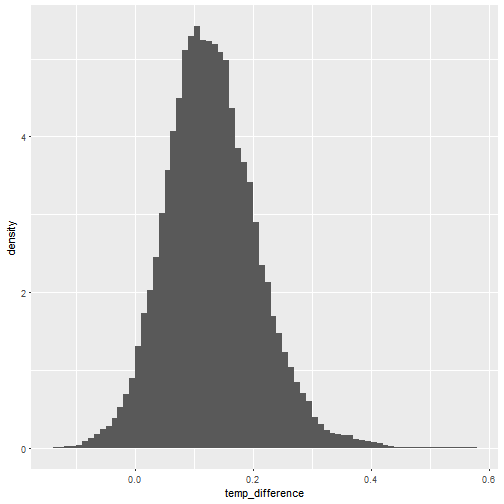
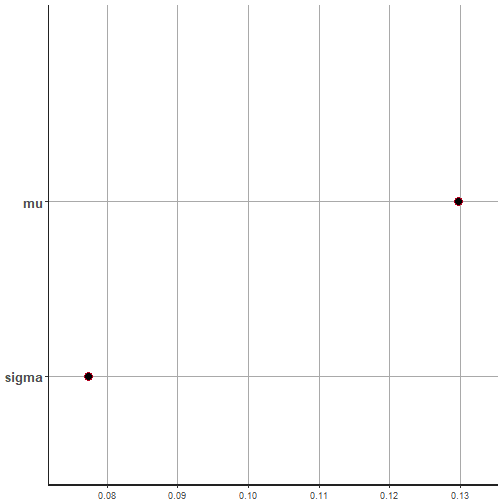
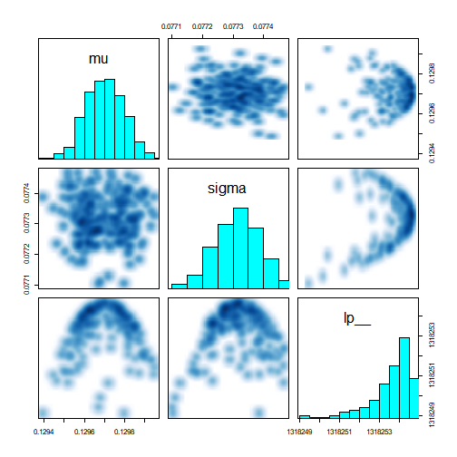

# Cosmological Microwave Background (CMB) Again

The code below reads in the data and makes an initial plot:


```r
library(tidyverse)

cmb <- read_csv("http://www.evanlray.com/stat343_s2018/data/bayesian_core/CMBdata.txt",
    col_names = FALSE)
names(cmb) <- "temp_difference"

ggplot(data = cmb, mapping = aes(x = temp_difference)) +
  geom_histogram(center = 0.005, binwidth = 0.01, mapping = aes(y = ..density..))
```




#### Model

Let $X_1, \ldots, X_n$ denote the $n = 640000$ temperature differences.  We model these as independent, with each

$X_i \sim \text{Normal}(\mu, \sigma^2)$

This model has two parameters: $\mu$ and $\sigma^2$.  We will use the following prior distributions for these parameters:

An non-informative prior for $\mu$ (large variance):

$\mu \sim \text{Normal}(0, 1000^2)$

A non-informative prior for $\sigma$ (large variance):

$\sigma \sim \text{Gamma}(1, 0.01)$

# Estimation Code

We will use Stan to perform estimation.  Stan is a complete programming language of its own, specific to performing Bayesian inference for statistical models.  To do estimation with Stan and R, you will have code in two separate files:

1. An Stan file with code that specifies the data, parameters, and model.
2. An R script or notebook file with code that preprocesses the data, calls Stan to do MCMC sampling, and then works with the output from Stan.

Those files are described below:

## normal.stan

Here is the content of the file normal.stan:


```r
data {
  int<lower=0> n; // number of observations
  real x[n]; // data: an array of length n where each entry is a real number
}

parameters {
  real mu;
  real<lower=0> sigma;
}

model {
  mu ~ normal(0, 1000); // prior for mu: normal with a very large variance; non-informative
  sigma ~ gamma(1, 0.01); // prior for sigma: gamma with shape = 1 and rate = 0.01; non-informative
  x ~ normal(mu, sigma); // data model: each element of x follows a normal(mu, sigma) distribution
}
```

The `data` block in the Stan file describes fixed, known quantities that will be passed in to Stan.  In this case, we have said that we will tell Stan what our sample size is (`n`) and give it a vector of length `n` with observed data values `x`.

The `parameters` block defines parameters to estimate; in this case, the mean `mu` and standard deviation `sigma` of the normal distribution.

The `model` block defines our prior distributions and data model.

Stan takes these ingredients and creates a program in C++ that will perform Bayesian estimation for this model using a MCMC approach called Hamiltonian Monte Carlo.

## R code to interface with Stan

Here's a walk through of R code that can be used to interface with the Stan program defined above.

#### Load the data


```r
library(tidyverse)

cmb <- read_csv("http://www.evanlray.com/stat343_s2018/data/bayesian_core/CMBdata.txt",
  col_names = FALSE)
```

```
## Parsed with column specification:
## cols(
##   X1 = col_double()
## )
```

```r
names(cmb) <- "temp_difference"
```

#### Call Stan to do the estimation


```r
library(rstan)
```

```
## Warning: package 'rstan' was built under R version 3.4.3
```

```
## Loading required package: StanHeaders
```

```
## Warning: package 'StanHeaders' was built under R version 3.4.3
```

```
## rstan (Version 2.17.3, GitRev: 2e1f913d3ca3)
```

```
## For execution on a local, multicore CPU with excess RAM we recommend calling
## options(mc.cores = parallel::detectCores()).
## To avoid recompilation of unchanged Stan programs, we recommend calling
## rstan_options(auto_write = TRUE)
```

```
## 
## Attaching package: 'rstan'
```

```
## The following object is masked from 'package:tidyr':
## 
##     extract
```

```r
rstan_options(auto_write = TRUE)

fit <- stan(
  file = "normal.stan",
  data = list(n = nrow(cmb), x = cmb$temp_difference),
  iter = 1000,
  chains = 1)
```

```
## In file included from C:/Users/eray/Documents/R/win-library/3.4/BH/include/boost/config.hpp:39:0,
##                  from C:/Users/eray/Documents/R/win-library/3.4/BH/include/boost/math/tools/config.hpp:13,
##                  from C:/Users/eray/Documents/R/win-library/3.4/StanHeaders/include/stan/math/rev/core/var.hpp:7,
##                  from C:/Users/eray/Documents/R/win-library/3.4/StanHeaders/include/stan/math/rev/core/gevv_vvv_vari.hpp:5,
##                  from C:/Users/eray/Documents/R/win-library/3.4/StanHeaders/include/stan/math/rev/core.hpp:12,
##                  from C:/Users/eray/Documents/R/win-library/3.4/StanHeaders/include/stan/math/rev/mat.hpp:4,
##                  from C:/Users/eray/Documents/R/win-library/3.4/StanHeaders/include/stan/math.hpp:4,
##                  from C:/Users/eray/Documents/R/win-library/3.4/StanHeaders/include/src/stan/model/model_header.hpp:4,
##                  from file43184cea1953.cpp:8:
## C:/Users/eray/Documents/R/win-library/3.4/BH/include/boost/config/compiler/gcc.hpp:186:0: warning: "BOOST_NO_CXX11_RVALUE_REFERENCES" redefined
##  #  define BOOST_NO_CXX11_RVALUE_REFERENCES
##  ^
## <command-line>:0:0: note: this is the location of the previous definition
## In file included from C:/Users/eray/Documents/R/win-library/3.4/StanHeaders/include/stan/math/rev/core.hpp:44:0,
##                  from C:/Users/eray/Documents/R/win-library/3.4/StanHeaders/include/stan/math/rev/mat.hpp:4,
##                  from C:/Users/eray/Documents/R/win-library/3.4/StanHeaders/include/stan/math.hpp:4,
##                  from C:/Users/eray/Documents/R/win-library/3.4/StanHeaders/include/src/stan/model/model_header.hpp:4,
##                  from file43184cea1953.cpp:8:
## C:/Users/eray/Documents/R/win-library/3.4/StanHeaders/include/stan/math/rev/core/set_zero_all_adjoints.hpp:14:17: warning: 'void stan::math::set_zero_all_adjoints()' defined but not used [-Wunused-function]
##      static void set_zero_all_adjoints() {
##                  ^
## 
## SAMPLING FOR MODEL 'normal' NOW (CHAIN 1).
## 
## Gradient evaluation took 0.006 seconds
## 1000 transitions using 10 leapfrog steps per transition would take 60 seconds.
## Adjust your expectations accordingly!
## 
## 
## Iteration:   1 / 1000 [  0%]  (Warmup)
## Iteration: 100 / 1000 [ 10%]  (Warmup)
## Iteration: 200 / 1000 [ 20%]  (Warmup)
## Iteration: 300 / 1000 [ 30%]  (Warmup)
## Iteration: 400 / 1000 [ 40%]  (Warmup)
## Iteration: 500 / 1000 [ 50%]  (Warmup)
## Iteration: 501 / 1000 [ 50%]  (Sampling)
## Iteration: 600 / 1000 [ 60%]  (Sampling)
## Iteration: 700 / 1000 [ 70%]  (Sampling)
## Iteration: 800 / 1000 [ 80%]  (Sampling)
## Iteration: 900 / 1000 [ 90%]  (Sampling)
## Iteration: 1000 / 1000 [100%]  (Sampling)
## 
##  Elapsed Time: 15.458 seconds (Warm-up)
##                17.576 seconds (Sampling)
##                33.034 seconds (Total)
```

 * R's interface with Stan is provided by a package called `rstan`
 * A major part of the run time when calling Stan comes from creating and compiling the C++ program to do estimation.  The command `rstan_options(auto_write = TRUE)` ensures that this is done only the first time you call Stan.
 * The `stan` function does estimation.  Here we have used 4 arguments:
    * `file`: the stan file with the model definition, created above.
    * `data`: a named list with one entry for each variable declared in the `data` block of the stan file.
    * `iter`: how many iterations to perform (how many samples to draw from the posterior in each MCMC chain).
    * `chains`: how many MCMC chains to run; here, just 1.

#### View the results

The `rstan` package comes with some pretty useful default functions to display and summarize the samples from the posterior distribution:


```r
print(fit)
```

```
## Inference for Stan model: normal.
## 1 chains, each with iter=1000; warmup=500; thin=1; 
## post-warmup draws per chain=500, total post-warmup draws=500.
## 
##            mean se_mean   sd      2.5%       25%       50%       75%
## mu    1.300e-01    0.00 0.00 1.300e-01 1.300e-01 1.300e-01 1.300e-01
## sigma 8.000e-02    0.00 0.00 8.000e-02 8.000e-02 8.000e-02 8.000e-02
## lp__  1.318e+06    0.11 0.99 1.318e+06 1.318e+06 1.318e+06 1.318e+06
##           97.5% n_eff Rhat
## mu    1.300e-01   500    1
## sigma 8.000e-02    52    1
## lp__  1.318e+06    87    1
## 
## Samples were drawn using NUTS(diag_e) at Thu Mar 08 12:32:19 2018.
## For each parameter, n_eff is a crude measure of effective sample size,
## and Rhat is the potential scale reduction factor on split chains (at 
## convergence, Rhat=1).
```

```r
plot(fit)
```

```
## ci_level: 0.8 (80% intervals)
```

```
## outer_level: 0.95 (95% intervals)
```



```r
pairs(fit, pars = c("mu", "sigma", "lp__"))
```



We can also extract the parameter samples and compute summaries like posterior means and credible intervals by hand. The extract function returns a named list with a component for each parameter defined in the stan model file.


```r
param_samples <- rstan::extract(fit)

mu_samples <- param_samples$mu
sigma_samples <- param_samples$sigma

mean(mu_samples)
```

```
## [1] 0.1297
```

```r
mean(sigma_samples)
```

```
## [1] 0.07732
```

```r
quantile(mu_samples, probs = c(0.025, 0.975))
```

```
##   2.5%  97.5% 
## 0.1295 0.1299
```

```r
quantile(sigma_samples, probs = c(0.025, 0.975))
```

```
##    2.5%   97.5% 
## 0.07718 0.07745
```
